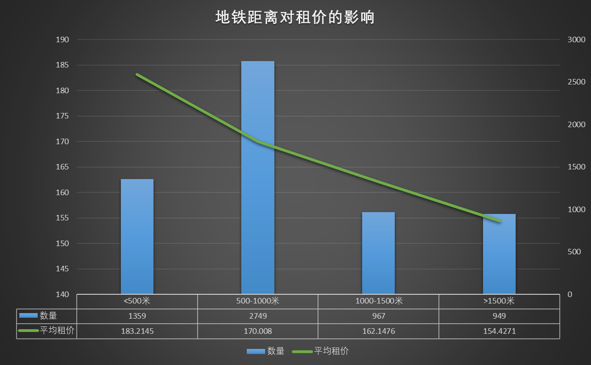

[TOC]

# 1. 数据集说明

这是一份北京的租房数据，总计7000 多 条记录，分为 8 个同样结构的 CSV 数据文件。

# 2. 数据处理

格式检查 -> 数据合并 -> 简单清洗, 保存一次 -> 二次清洗, 拆、丢、填和格式化 -> 保存, 入库

[查看代码](etl.py)

清洗后的数据：


# 3.数据分析可视化

## 3.1 整体情况

```
SELECT 
	AVG(`价格`) `平均价格`,
	AVG(`面积`) `平均面积`,
	AVG(`所在楼层`) `平均楼层`,
    AVG(CASE WHEN `地铁距离` <> 65535 THEN `地铁距离` END) AS `平均地铁距离`,
    (SELECT `室` FROM rent GROUP BY `室` ORDER BY COUNT(`室`) DESC LIMIT 1) `室(最多)`,
    (SELECT `卫` FROM rent GROUP BY `卫` ORDER BY COUNT(`卫`) DESC LIMIT 1) `卫(最多)`,
    SUM(`价格`) / SUM(`面积`) `每平米租价`
FROM rent;
```


## 3.2 地区分析

房源数量分布情况如下，可以看到朝阳和通州这两个地区的房源数量要远大于其它区，说明这两个地方的租赁市场比较活跃，人员流动和人口密度可能也比较大。


## 3.3 小区分析

```
SELECT `小区`, SUM(`价格`) / SUM(`面积`) `平均地租`
FROM rent
GROUP BY `小区`
ORDER BY `平均地租` DESC
LIMIT 10;
```

房租最贵的小区 TOP 10。半壁街南路 1 号院的房租最高，达到 596 元/平米，是平均值 169  元/平米的 **3** 倍。


## 3.4 户型楼层分析

从户型的房源数量分布来看，主要集中在 3室1卫 和 4室1卫的户型。而且，让人吃惊的是它们的平均面积才13个平方!
不愧是北京, 寸土寸金不是开玩笑的。


国家规定楼层 7 层以上需要装电梯，依据这个规定，我们根据楼层数来判断房源是否有电梯。
```
SELECT 
	CASE WHEN `总楼层` > 7 THEN '电梯房' ELSE '非电梯房' END `类型`,
	COUNT(1) `数量`,
	AVG(`面积`) `平均面积`,
    SUM(`价格`) / SUM(`面积`) `平均地租`
FROM rent GROUP BY `类型`;
```

从下图可以看到, 电梯房的房源数量比较多，毕竟楼层高，房子也就越多。
在平均面积上, 二者差距不大; 
而在平均地租上, 电梯房明显贵一些, 这有几点解释:

①便利, 避免爬楼梯; 

②配备电梯的建筑往往意味着更高的建筑质量和设计标准;

③电梯房的维护和管理成本较高，这些成本最终会转嫁到租金上; 


在使用"总楼层"区分出电梯房之后，我们再结合"所在楼层"进行分析。

我们不妨先对所在楼层的高低程度进行简单划分:

对于楼梯房, 低楼层(1-10)、中楼层(10-20)、高楼层(>20)。
而非楼梯房, 低楼层(1-2)、中楼层(3-4)、高楼层(5-7)。

```
SELECT 
	CASE WHEN `总楼层` > 7 THEN '电梯房' ELSE '非电梯房' END `房子分类`,
    CASE WHEN `总楼层` > 7 
		THEN (CASE WHEN `所在楼层` < 10 THEN '低楼层' WHEN `所在楼层` > 19 THEN '高楼层' ELSE '中楼层' END) 
		ELSE (CASE WHEN `所在楼层` < 3 THEN '低楼层' WHEN `所在楼层` > 4 THEN '高楼层' ELSE '中楼层' END)
		END `楼层分类`,
    SUM(`价格`) / SUM(`面积`) `平均地租`,
    COUNT(1) `数量`
FROM rent
GROUP BY `房子分类`, `楼层分类`;
```


从租金上看，电梯房的高楼层会明显更贵。非电梯房的则是低楼层更贵。

显然, 对于电梯房而言，无论如何都是坐电梯，此时低楼层的方便程度较高楼层基本没有差别;

相反，高楼层由于更好的采光, 更宽的视野, 更多的隐私 和 较低的噪音干扰, 更受租房人青睐。

而对于非电梯房, 显然楼层越低出行也越方便。而且由于北京天气干燥，楼层较低也基本不会出现潮湿渗水等的情况，
很自然低楼层的租价就更高了。

但无论如何, 从总体上看, 电梯房的平均租金都是要高于非电梯房。


## 3.5 交通分析

```
SELECT 
	CASE WHEN `地铁距离` < 500 THEN '<500米'
		 WHEN `地铁距离` BETWEEN 500 AND 1000 THEN '500-1000米'
         WHEN `地铁距离` BETWEEN 1000 AND 1500 THEN '1000-1500米'
         ELSE '>1500米' END `地铁距离划分`,
	SUM(`价格`) / SUM(`面积`) `平均租价`,
    COUNT(1) `数量`
FROM rent
GROUP BY `地铁距离划分`;
```

从下图可以看到, 离地铁越近, 租金就越高, 符合一般认知。

此外, 距离地铁500-1000米的房源最多, 说明大部分房源虽然不是非常接近地铁, 但基本上距离都不算远。


